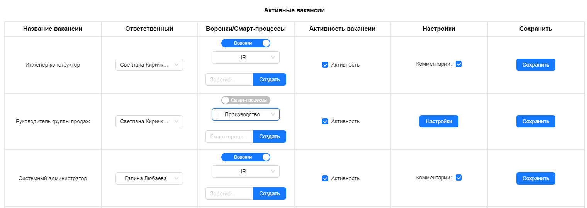
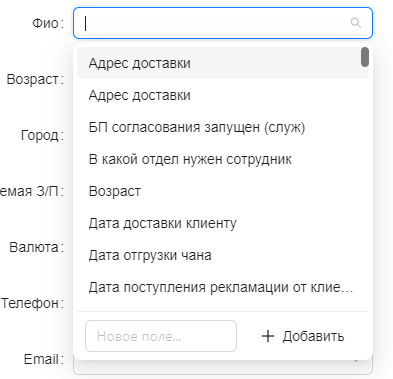
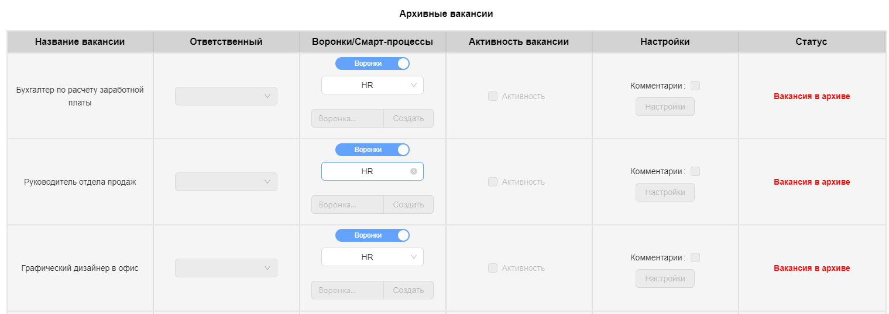
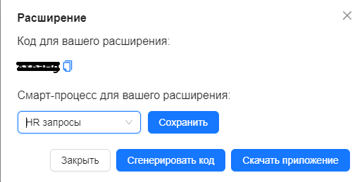

# Интеграция HH.ru + Bitrix24

## Описание проекта

Проект заключается в интеграции сервиса **HeadHunter** с платформой **Bitrix24**. Эта интеграция обеспечивает удобную работу с резюме, полученными с портала hh.ru, непосредственно через CMS Bitrix, и наоборот.

### Основные функции интеграции:

1. **Работа с вакансиями:**
   - Назначение ответственного за вакансии.
   - Создание и выбор воронок в Bitrix24.
   - Создание и выбор смарт-процессов для вакансий.

2. **Импорт резюме:**
   - Расширение, позволяющее импортировать резюме из hh.ru в Bitrix24.

3. **Умные поля:**
   - Возможность создавать умные поля в Bitrix24, используя данные из HeadHunter.
   - Импорт полей в комментарии.

4. **Дополнительные функции:**
   - Отображение архивных вакансий с отключенным функционалом.
   - Показ полной информации о пользователях hh.ru и Bitrix24.
   - Авторизация на обоих порталах.
   - Кнопка для включения/выключения импорта резюме.
   - Генерация случайного кода для привязки расширения к HeadHunter.

### Особенности:

- Функционал к смарт-процессам доступен только при определенных тарифах.
- Возможность разлогиниться из системы.

Проект направлен на упрощение процесса работы с вакансиями и резюме, обеспечивая гладкую интеграцию между двумя важными платформами рекрутинга и управления задачами.

## Назначение проекта 🎯

Проект интеграции сервиса **HeadHunter** с платформой **Bitrix24** был создан с целью решения ряда ключевых проблем и удовлетворения конкретных потребностей в области управления человеческими ресурсами.

### Зачем был создан этот проект:

1. **Упрощение процесса рекрутинга** 💼:
   - Облегчение поиска и управления кандидатами, уменьшение времени на обработку резюме.

2. **Централизация рабочего процесса** 🌐:
   - Интеграция двух ключевых платформ обеспечивает единый рабочий интерфейс для HR-специалистов.

3. **Автоматизация рутинных задач** 🤖:
   - Автоматический импорт резюме и синхронизация данных между платформами сокращает время на рутинные операции.

4. **Повышение эффективности взаимодействия с вакансиями** 📈:
   - Легкий доступ к информации о вакансиях, управление кандидатами и воронками отбора в одном месте.

5. **Гибкость и масштабируемость** 🌟:
   - Решение адаптируется под разные бизнес-процессы и может масштабироваться в зависимости от нужд компании.

Проект призван оптимизировать процесс найма, улучшая взаимодействие между HR-отделом и потенциальными сотрудниками, а также обеспечивая более эффективное управление человеческими ресурсами.

## Галерея

## Моя роль в проекте 💻🌟

Как **Front-end разработчик**, я играл ключевую роль в разработке и реализации проекта интеграции **HeadHunter** и **Bitrix24**. Мой вклад охватывал несколько важных областей, которые были критически важны для успеха проекта.

### Мои обязанности и вклад:

1. **Разработка интерфейса** 🎨:
   - Создание удобного и интуитивно понятного пользовательского интерфейса для интеграции.
   - Обеспечение согласованности визуального стиля с существующими элементами обеих платформ.

2. **Реализация взаимодействия с пользователем** 👥:
   - Разработка интерактивных элементов для эффективного взаимодействия пользователя с системой.
   - Обеспечение адаптивности интерфейса для различных устройств и экранов.

3. **Интеграция с бэкендом** 🔗:
   - Сотрудничество с бэкенд-разработчиками для интеграции пользовательского интерфейса с серверной логикой.
   - Реализация AJAX-запросов для асинхронного взаимодействия с сервером.

4. **Тестирование и оптимизация** 🚀:
   - Выполнение тестирования интерфейса для обеспечения безошибочной работы.
   - Оптимизация производительности фронтенда для более быстрой загрузки и отзывчивости.

5. **Обратная связь и улучшения** 🔄:
   - Работа с командой для сбора обратной связи и внесения улучшений в интерфейс на основе пользовательских отзывов.

Моя роль в проекте была сосредоточена на предоставлении конечным пользователям лучшего опыта взаимодействия с системой, учитывая их потребности и ожидания, а также технические требования проекта.

## Технологии, используемые в проекте 🛠️

## Принципы и инструменты разработки
- Код-стиль и форматирование: Prettier
- Линтер: ESLint
- Система контроля версий: Git + GitHub
- Прочие инструменты: Vite

## Команда
- Общее количество человек: 3
- Роли в команде:
  - Front-end Developer: 1
  - Back-end Developer: 1
  - Team-Lead: 1

## Основные достижения и результаты
В процессе работы над этим проектом мной были достигнуты следующие ключевые результаты:

1. **Успешная интеграция**: Была успешно реализована интеграция между "HH.ru" и Битрикс24, что позволило пользователям эффективно синхронизировать данные между двумя платформами. 🔄

2. **Улучшение пользовательского опыта**: Благодаря использованию современных технологий и подходов к разработке, пользовательский интерфейс стал более отзывчивым и удобным для взаимодействия. 🖌️

3. **Оптимизация процессов**: Автоматизация рутинных задач, таких как проверка авторизации, создание и управление вакансиями, значительно ускорила и оптимизировала рабочие процессы пользователей. ⚙️

4. **Ускорение разработки**: Применение архитектуры Feature-Sliced-Design и готовых компонентов из Ant-Design позволило существенно ускорить процесс разработки. 🚀

5. **Облегчение поддержки**: Кодовая база стала более структурированной и легкой для понимания, что упростило дальнейшую поддержку и развитие проекта. 🛠️

6. **Повышение качества продукта**: Использование TypeScript и MobX способствовало написанию более надежного и безопасного кода. 🛡️

7. **Позитивный отклик от пользователей**: Внедрение новой системы получило положительные отзывы от пользователей, что подтвердило эффективность и актуальность проведенных изменений. 👍

Эти достижения стали возможны благодаря совместной работе всей команды, а также моему личному вкладу в разработку Front-end части проекта.

## Особые вызовы и преодоленные препятствия

В ходе разработки проекта мы столкнулись с несколькими сложностями, которые требовали тщательного анализа и принятия взвешенных решений.

1. **Сложности с интеграцией:**
   - Первоначально процесс интеграции "HH.ru" и Битрикс24 представлял собой сложную задачу из-за различий в их API.
   - Мы решили эту проблему, тщательно изучив документацию обоих сервисов и применив адаптеры для преобразования данных.

2. **Проблемы с авторизацией:**
   - Пользователи иногда сталкивались с проблемами при попытке авторизоваться в обеих системах.
   - Мы устранили эти проблемы, улучшив механизм обработки ошибок и предоставив более четкие инструкции для пользователей.

3. **Высокая нагрузка на сервер:**
   - Большое количество одновременных запросов к API могло привести к перегрузке сервера.
   - Мы оптимизировали код, чтобы уменьшить количество запросов и реализовали кеширование для снижения нагрузки.

4. **Проблемы с производительностью интерфейса:**
   - Интерфейс приложения мог замедляться при работе с большими объемами данных.
   - Применение виртуализации списков и оптимизация рендеринга компонентов помогли решить эту проблему.

5. **Недостатки в документации:**
   - Некоторые моменты в документации "HH.ru" и Битрикс24 были не совсем ясны или устарели.
   - Мы преодолели это, общаясь непосредственно с их технической поддержкой.

Преодоление этих трудностей потребовало времени и усилий, но в конечном итоге позволило создать более стабиль

## Ссылки
- Демо проекта: Полная версия скоро появится на маркетплейс Bitrix24
- Код проекта: На данный момент, из-за ограничений, связанных с неразглашением информации (НДА), код проекта не может быть общедоступным.

Я придерживаюсь политики конфиденциальности и соблюдаю соглашения о неразглашении, поэтому кода проекта нет в общем доступе.
Если у вас есть вопросы относительно кода или функциональности проекта, пожалуйста, свяжитесь со мной напрямую, и я постараюсь предоставить необходимую информацию
